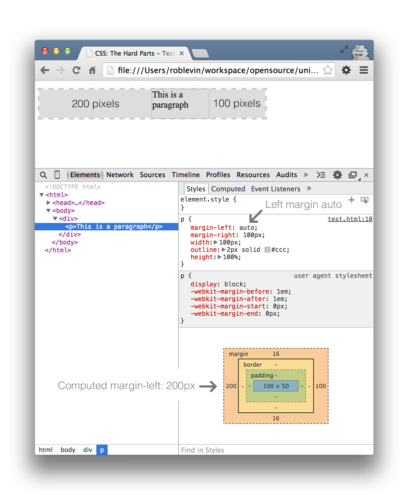

# CSS: The Hard Parts

This will be the repo for the book CSS: The Hard Parts.

## Setup

In order to build the book on a local machine, you will need to follow the instructions below.

### Dependencies

Pandoc: https://github.com/jgm/pandoc/releases/
Download and run most recent installer dmg

Kindlegen CLI: http://www.amazon.com/gp/feature.html?docId=1000765211
- Unpack and symlink to it e.g.:

```shell
ln -s ~/bin/KindleGen_Mac_i386_v2_9/kindlegen /usr/local/bin
```
You should now have `pandoc` and `kindlegen` available in your shell.

pdflatex: In order to build out PDF files you need to install mactex which is 2.4gb!
https://tug.org/mactex/
```shell
# Find its path with: `find /usr/ -name "pdflatex"
$ ln -s /usr/texbin/pdflatex /usr/local/bin # symlink it
```

### Tools

#### Previewing

Kindle Previewer
http://www.amazon.com/gp/feature.html/?docId=1000765261

Adobe Epub Reader
http://www.adobe.com/products/digital-editions.html


#### Validating/Debugging

EpubCheck from https://github.com/IDPF/epubcheck/releases and run the following command after unzipping it:
java -jar ~/bin/epubcheck-v4.0.0-alpha9/epubcheck.jar ~/workspace/opensource/unicorn/buttons-book/secret-to-creating-buttons.epub

More debugging tips here:
http://puppetlabs.com/blog/automated-ebook-generation-convert-markdown-epub-mobi-pandoc-kindlegen


### Gotchas

Images will float to the next available page and surrounding text will appear in the wrong order unless you escape the image:
http://comments.gmane.org/gmane.text.pandoc/8350
For example, note the last '\' backslash character:

```markdown
\
```

In order to get our figure captions back–they get removed once we apply the above trick–we've added the captions directly as follows:

```pre
<div class="figure-caption-wrapper">
\

<div class="figure-caption">margin-left of auto results in a computed value required for total width to be equal to width of containing block</div>
</div>
```

## Reference Materials

http://johnmacfarlane.net/pandoc/epub.html

http://puppetlabs.com/blog/automated-ebook-generation-convert-markdown-epub-mobi-pandoc-kindlegen

https://gist.github.com/sudarkoff/3956724


